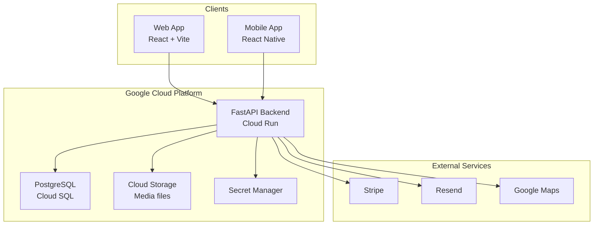
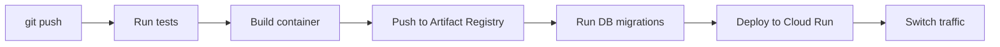
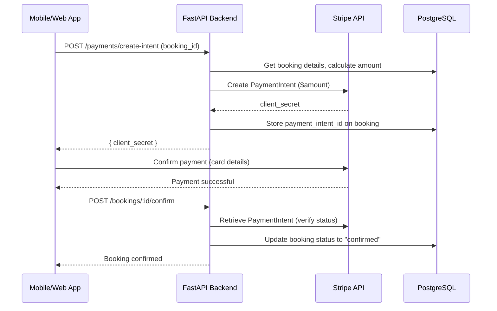
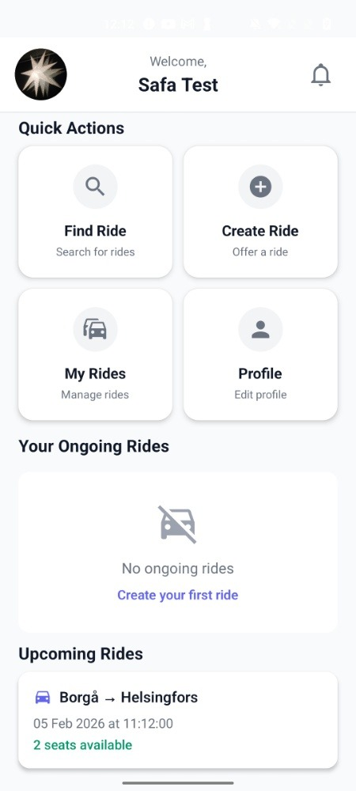
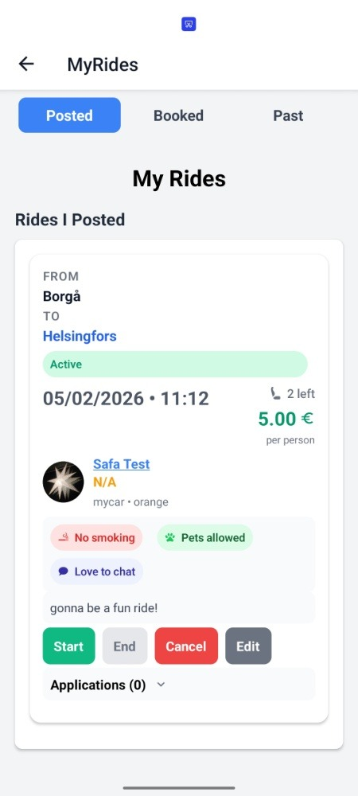
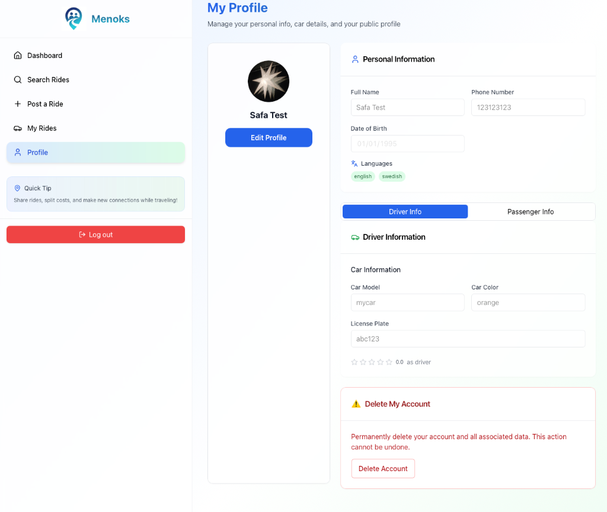
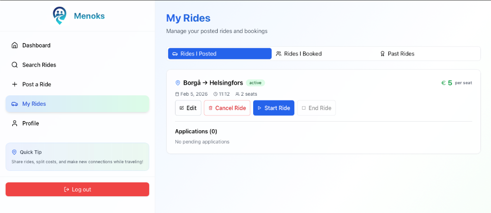

<p align="center">
  
</p>

<p align="center">
  <strong>ridesharing platform — web, mobile & API</strong><br/>
  <a href="https://menoks.app">menoks.app</a>
</p>

<p align="center">
  
  
  
  
  
</p>

---

## What is Menoks?

Menoks connects drivers offering rides with passengers looking for one. Carpooling with a proper booking system, payments, ratings, and messaging built in.

**What I built:**
- Web app (React + Vite + TypeScript) → [menoks.app](https://menoks.app)
- Mobile app for iOS/Android (React Native + Expo)
- REST API backend (FastAPI + PostgreSQL)
- Full CI/CD pipeline to GCP

---

## Architecture Overview



---

## Tech Stack

### Backend

| Tech | Why I chose it |
|------|----------------|
| **FastAPI** | Async by default, auto-generates OpenAPI docs, plays nice with Pydantic |
| **SQLAlchemy 2.0** | Async support finally works well, and the new API is cleaner |
| **PostgreSQL** | Rock solid, handles relationships properly, Cloud SQL makes it easy |
| **Alembic** | Keeps migrations in version control where they belong |
| **Pydantic v2** | Validation that just works, plus the TypeScript-like schema definitions |

The backend follows a repository pattern:

```
Routes → Services → Repositories → Models
           ↑
        Schemas (Pydantic)
```

This keeps business logic separate from data access. Makes testing easier and the codebase doesn't turn into spaghetti.

### Frontend

| Tech | Why I chose it |
|------|----------------|
| **React 18** | Hooks, concurrent features, massive ecosystem |
| **Vite** | Dev server starts instantly, HMR is actually fast, no more waiting for webpack |
| **TailwindCSS** | Utility classes are faster to write than CSS files, purges unused styles |
| **TypeScript** | Catches bugs before runtime, makes refactoring safe |

### Mobile

| Tech | Why I chose it |
|------|----------------|
| **React Native** | Shares logic with web, native performance where it matters |
| **Expo SDK 54** | Handles builds, updates, and native modules without touching Xcode/Android Studio |
| **Expo Secure Store** | Tokens stored in actual keychain/keystore, not AsyncStorage |
| **Stripe RN SDK** | Native payment sheet, handles PCI compliance |

### Infrastructure

- **Cloud Run** — Containers that scale to zero when idle, no server management
- **Cloud SQL** — Managed Postgres with automatic backups
- **Cloud Storage** — Profile photos and media with signed URLs
- **Secret Manager** — No more `.env` files floating around
- **Firebase Hosting** — CDN for the web app, handles SSL

---

## CI/CD Pipeline

Push to `main` triggers the whole pipeline:



The mobile app uses EAS Build — push a command, get a signed APK/IPA back. No local Android Studio or Xcode needed.

---

## Database Architecture

The database layer uses **PostgreSQL 15** on Cloud SQL with **SQLAlchemy 2.0** as the ORM and **asyncpg** as the async driver.

**Why async matters:** Traditional ORMs block the thread while waiting for database responses. With asyncpg, the FastAPI event loop stays free to handle other requests during I/O waits. This means a single Cloud Run instance can handle significantly more concurrent requests.

**Connection management:**
```python
# Async session factory with connection pooling
engine = create_async_engine(
    DATABASE_URL,
    pool_size=5,
    max_overflow=10,
    pool_pre_ping=True  # Validates connections before use
)
```

The `pool_pre_ping` is important for Cloud SQL — connections can go stale if the instance scales down, and this catches dead connections before they cause errors.

**Eager loading pattern:**
One of the tricky parts with async SQLAlchemy is that lazy loading doesn't work. If you return a model with relationships from an endpoint, Pydantic tries to access those relationships during serialization, but the session is already closed.

```python
# This fails in async context — lazy load after session closed
@router.get("/rides/{id}", response_model=RideWithBookings)
async def get_ride(id: str, db: AsyncSession):
    ride = await db.get(Ride, id)
    return ride  # Crashes when accessing ride.bookings

# This works — eager load upfront
query = select(Ride).options(selectinload(Ride.bookings)).where(Ride.id == id)
result = await db.execute(query)
ride = result.scalar_one()
```

**Migrations with Alembic:**
Schema changes are version-controlled. The CI/CD pipeline runs `gcloud run jobs execute migrate-job` before deploying new code, so the database is always in sync with what the app expects.

---

## Payment System

Payments use **Stripe** with a server-side payment intent flow. The client never touches card details directly — everything goes through Stripe's SDK.



**Why this flow:**
1. **PCI compliance** — Card details go directly from the client to Stripe. Our servers never see them.
2. **Idempotency** — Payment intents are tied to booking IDs. If something fails, retrying doesn't double-charge.
3. **Verification** — The backend always checks with Stripe before confirming. We don't trust the client saying "payment worked."

**Mobile implementation:**
The React Native app uses `@stripe/stripe-react-native` which provides a native payment sheet. It handles card input, validation, 3D Secure authentication, and Apple/Google Pay — all without us having to build any of that UI.

**Handling edge cases:**
- If the user closes the app mid-payment, the payment intent stays in "requires_confirmation" state. Next time they open the booking, we check for existing intents and resume.
- Failed payments log the error but don't delete the booking — users can retry.
- The booking status only flips to "confirmed" after we verify the payment intent status server-side.

---

## Security

Not just "we use HTTPS":

**Authentication**
- JWT tokens with bcrypt-hashed passwords
- Email verification before account activation
- Mobile tokens stored in secure keychain, not plain storage

**API**
- CORS locked to specific origins
- All input validated through Pydantic before it touches the database
- SQLAlchemy ORM prevents SQL injection

**Infrastructure**
- Secrets in GCP Secret Manager, not environment variables
- Containers run as non-root user
- Cloud SQL only accessible from Cloud Run (not public internet)

**HTTP Headers** (via Firebase Hosting)
```
X-Frame-Options: DENY
X-Content-Type-Options: nosniff
X-XSS-Protection: 1; mode=block
Referrer-Policy: strict-origin-when-cross-origin
```

---

## API Design

RESTful endpoints under `/api/v1`:

```
POST   /auth/login
POST   /auth/register
GET    /rides
POST   /rides
GET    /rides/:id
POST   /bookings
PUT    /bookings/:id/status
POST   /payments/create-intent
GET    /messages/ride/:id
POST   /ratings
```

Every endpoint returns consistent JSON:
```json
{
  "data": { ... },
  "message": "Success"
}
```

There's also middleware that logs slow requests (>500ms) so I can catch performance issues early.

---

## Performance

**Async I/O throughout the stack:**
FastAPI runs on Uvicorn with uvloop, which is a drop-in replacement for Python's asyncio event loop written in Cython. Database queries use asyncpg which communicates with PostgreSQL using the binary protocol instead of text — faster parsing, less overhead.

**Response time monitoring:**
Custom middleware measures every request and adds an `X-Response-Time-Ms` header. Anything over 500ms gets logged as a warning, so I can spot slow endpoints before users complain.

```python
class ResponseTimeMiddleware(BaseHTTPMiddleware):
    async def dispatch(self, request, call_next):
        start = time.perf_counter()
        response = await call_next(request)
        duration_ms = (time.perf_counter() - start) * 1000
        response.headers["X-Response-Time-Ms"] = f"{duration_ms:.2f}"
        if duration_ms > 500:
            logger.warning(f"Slow: {request.url.path} took {duration_ms:.0f}ms")
        return response
```

**Frontend bundle optimization:**
Vite splits the bundle by route using dynamic imports. The initial load only includes what's needed for that page. TailwindCSS purges unused classes at build time — the final CSS is typically under 20KB gzipped.

**Mobile rendering:**
React Native lists use `FlatList` with virtualization — only visible items are rendered. For expensive computations like sorting/filtering rides, `useMemo` prevents recalculation on every render. The Hermes JS engine (enabled by default in Expo SDK 54) significantly improves startup time and memory usage compared to JavaScriptCore.

---

## What I Learned

Building this taught me a lot:

- **Async Python is tricky** — lazy loading doesn't work with async sessions, had to use eager loading everywhere
- **Mobile payments are complicated** — Stripe RN SDK handles most of it, but you still need to think about failure states
- **Expo is worth it** — building native apps without touching Xcode saved me hours
- **Secret Manager > .env files** — especially when you have multiple environments

---

## Links

- **Website:** [menoks.app](https://menoks.app)
- **Contact:** Open to collaboration and further development

---

## App Preview

<table>
  <tr>
    <td align="center" colspan="2"><h3>📱 Mobile App</h3></td>
  </tr>
  <tr>
    <td align="center">
      <br/>
      <sub><b>Dashboard</b><br/>Quick actions & upcoming rides</sub>
    </td>
    <td align="center">
      <br/>
      <sub><b>My Rides</b><br/>Manage posted rides & bookings</sub>
    </td>
  </tr>
</table>

<table>
  <tr>
    <td align="center" colspan="2"><h3>💻 Web App</h3></td>
  </tr>
  <tr>
    <td align="center" colspan="2">
      <br/>
      <sub><b>Profile Page</b> — Manage personal info, vehicle details, and driver/passenger settings</sub>
    </td>
  </tr>
  <tr>
    <td align="center" colspan="2">
      <br/>
      <sub><b>My Rides</b> — View posted rides, bookings, and manage applications</sub>
    </td>
  </tr>
</table>
